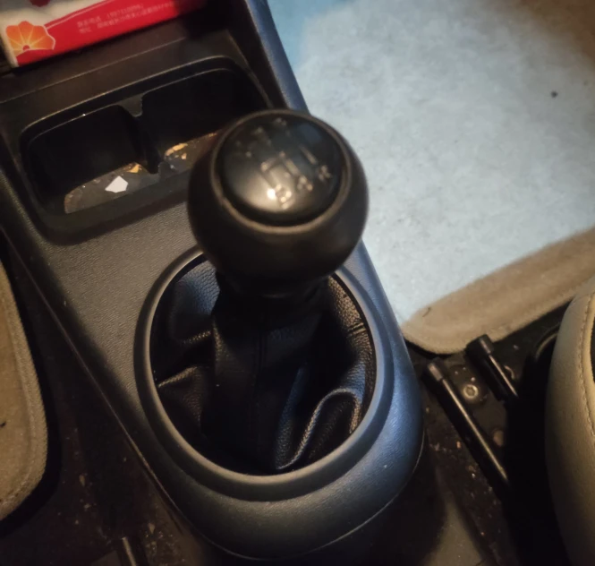
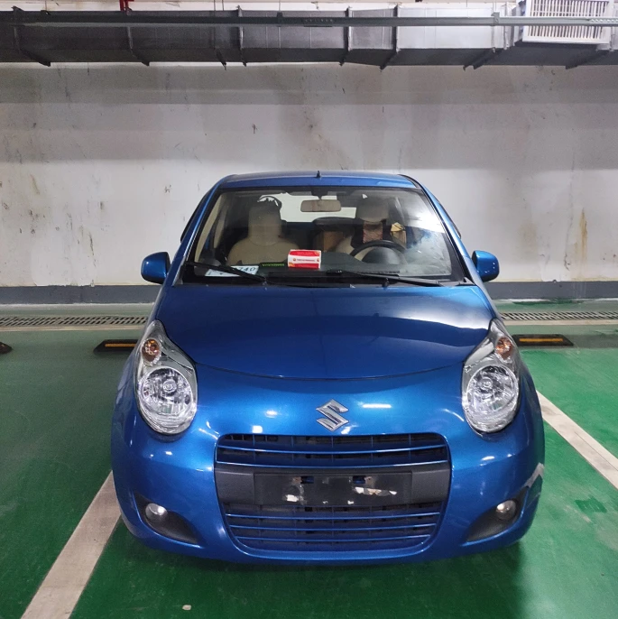
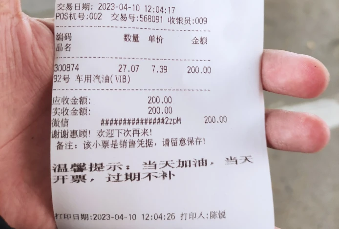
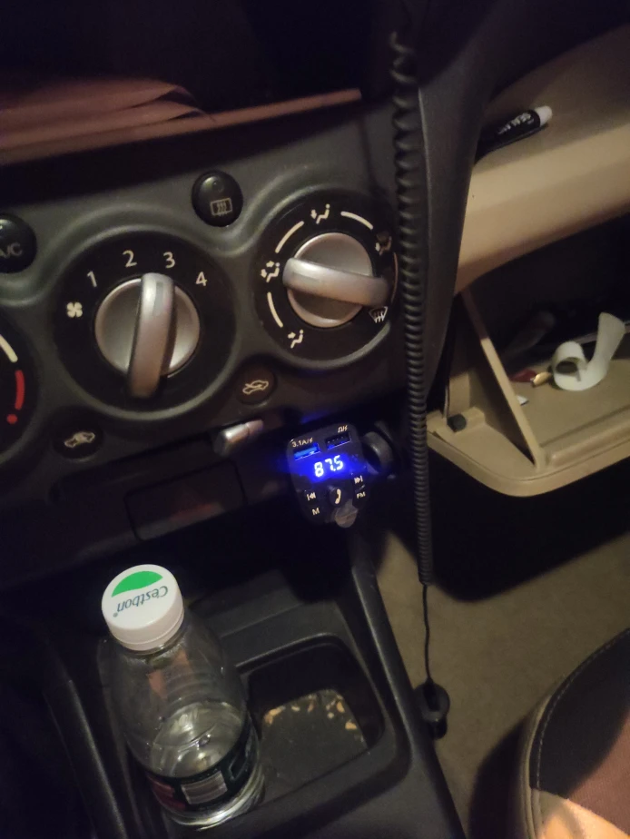
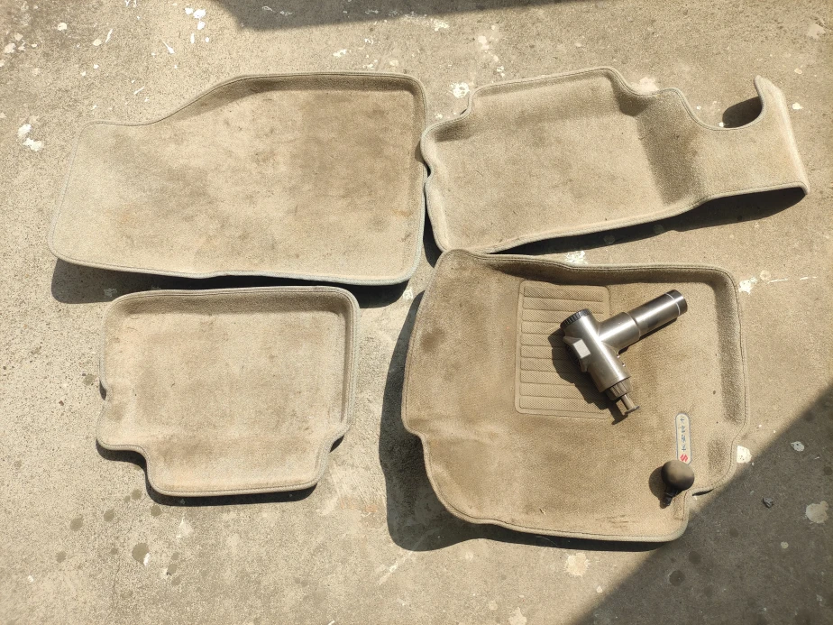
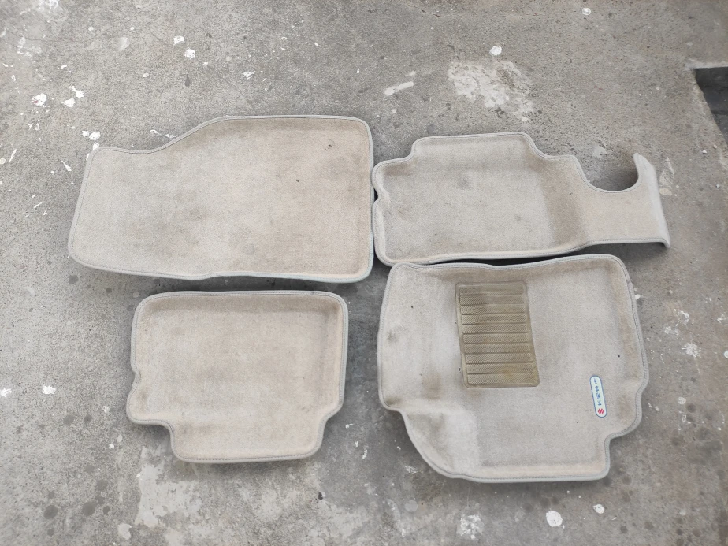
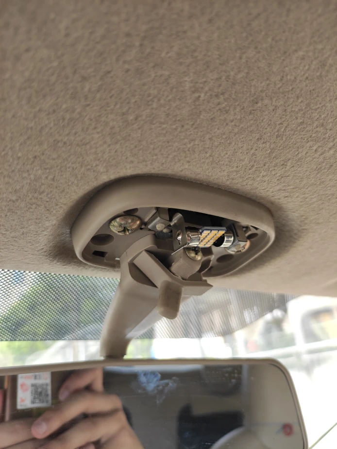

这是博主的第一辆车——2011年奥拓铃木、三缸机996cc、手动挡
<!--more-->

 
> Q: 为什么买车?  
> A: 自从摩托车卖出去之后，感受到了没有出行工具的不方便，其次我自己也有一个练练手的意愿，刚好C1驾照考下来了，于是乎就产生了这个想法。  

> Q: 买的什么车？
> A: 2011年长安铃木奥拓1.0L(996cc)三缸手动挡

> Q: 为什么买手动挡？
> A: 穷！手动挡才是开车！

> Q: 花了多少钱？  
> A: 7000￥，说实话可能贵了...保险花了2247￥(200万三者1072￥、司机险100￥、乘客险100￥、交强险855、车船税120￥) 详情可看下方的 **花费**

> Q: 手动挡好开吗？
> A: 不好开！但是很有乐趣（并不


车：7000￥  
提档过户：350￥ 
年检：250￥  
保险：2245￥  
大灯：580￥（工时80￥）  
杂七杂八：70.5￥  
WD-40：12￥  
前后雨刮：23￥
#### 加油（92号）
| 时间    | 加油量(L)    | 单价(￥)    | 金额（￥）    | 其他 |
|---------------- | --------------- | --------------- | --------------- | ----- |
| 2023-04-10    | 27.07    | 7.39    | 200    | 礼品：中石油的抽纸 |


### 2023/4/17
晚上把原车的前后雨刮给换了，前雨刮换成了有骨雨刷，后雨刮原厂件，至少不会再响了，还没测试效果怎么样。过几天再把
顶部的倒水槽的胶条换掉，因为上面有一点松了，怕跑快的时候他掉出来影响安全，但是胶条是真的好贵啊，两个得要50来块，
铃木淘宝原厂得要100￥。。。

### 2023/4/15
今天回一趟学校拿点东西，顺便和以前的同学聊会儿天，不过这一次还算挺不错的，我在上高架以及低速跟车的时候没怎么熄火，
唯一的不好的就是，我需要一直踩着离合，踮着油门，又要保持前车车距，还要防止加塞，同时保证我自己不能熄火，手动挡确实挺考验
技术的，还好一次没熄火，真的挺不想走这种堵堵停停的路况，太难受了......晚上回家的时候碰见了一辆 铃木北斗星 左右均有贴花
还是挺帅的，毕竟这车在路上就和我的奥拓一样不常见啊。

### 2023/4/14
晚上回家的时候可真是感受到了手动挡开起来是多么难受了，在上高架的时候特别堵。简直是地狱一般，高架上坡坡起，而且还是下雨天
越堵越慌，直接挂上一档踩到了5000-6000多转，烧胎起步给后车司机吓得一愣，这可真对不起我这个实习标 。。。手动挡最难受的地方——高架堵车坡起。

### 2023/4/12
现在开的越来越熟练了，跑路上基本上没有任何问题，奥拓这个车小，市区穿插尤其方便，况且动力也够用，80-100还是可以随便跑的
在路上超车也是游刃有余，对于这￥7000 块的车价我觉得还是买的很值的。今天主要是换了个档把套，其实一般来说球头、档把
这一套应该一起换掉的，但是在换之前我检查了下这个球头，前车主沾了些胶在上面，不太好弄，于是还是直接换档把套更实惠以及更快。




### 2023/4/10
今天早上去公司附近的汽修店把大灯换了一下，中间出了点小插曲，还好问题不大都解决了，花了工时费80￥，还是挺便宜的
在网上去途虎、天猫的话得要110￥出头了。换完大灯之后去加油站加了200￥的油，终于可以开始计算油耗了。




### 2023/4/9
今天换了一个点烟器，支持切换音乐和拥有两个USB接口，唯一不好的问题就是在导航的时候无法使用快捷键切换音乐。新购买
的大灯已经到了，准备明天去换。还有买的光盘不能播放，原因是因为光碟机太老了是DISC的，不支持MP3,得需要用那种容量小的盘
才能正常播放，本来打算换的，但是看光盘的价格30￥，还是暂时缓一缓吧，毕竟还能用蓝牙。




### 2023/4/8
今天周六，上午开着奥拓去医院拆智齿的线，途中停车遇到了一些波折，因为自己不敢倒库和侧方，都是直接开进去的，所以
找车位用了许久时间。拆线也是很快不到10秒钟就结束了，开车回去也到中午了，随便吃了点东西，之后就开始做下午的事情。
下午主要是把原车的脚垫给做了清理，真是累，从一点钟一直干到五点钟。这里我首先使用**筋膜枪**把一些灰尘给抖出来，
效果显著，灰尘抖出来之后就要开始上水清洗脚垫了，这部分没啥好说的，无非就是上清洗剂，浸泡一段时间后，拿软毛刷
疯狂的刷脏的地方，由于没有专业工具，这些事情干起来也是相当费时费力的，好在一切都还顺利。最后还换了个前排的
吊灯灯泡，比原车的亮了些。




### 2023/4/7
上班通勤15来公里，大概40来分钟可以到公司，由于是临牌进车库之内的都得保安抬杆，这种情况还需要持续几周，受限于
提档档案还没过来的原因。之后晚上回家的时候打开大灯发现有一边不亮，变成独眼龙了，看着怪诡异的，在公司地库练了
会儿倒车入库，是真的不太好操作，碍于我的车感不太行，好几把都压线，要不就是倒到旁边库去了，还好地库比较空，
很适合练车。换新大灯也提上来日程，在附近找了个修理厂，没想到一问，互相聊了会儿，还挺有来头，听老板说他自己认识我工作那栋楼的
老板之内的等等，这也是一个小插曲吧，于是换车灯的修理厂就顺理成章找到了。




### 2023/4/6
早上八点坐城铁去湘潭完成提档，本来是可以提前完成了，但是居住证5号才拿到。来当湘潭直奔车管所去了，由于是找了
代办，所以省去了很多事情，比如年检、交强险、之内的，前前后后花了2个小时多吧，在办商业险（三者200W）的时候出了些问题，
说是投保人（我）年龄太小，保费会高个100-200块，找家里年龄大的会比较便宜，这是其中出现的一个问题。然后在三者的前提下
我又购买力司机险、乘客险，这样才算作是全险，很多的保险公司不会告诉你有这个险，因为便宜但是赔的额度还高，所以
一般是不会说的，但是你要求他们还是会给办的。车检完了，保险也买完了之后我就从湘潭开回长沙了，途中还出现了一些
小插曲，比如我发现撒手会跑偏，以及有一次分心导致差点撞到！所以啊，开车一定不能分心，那几秒很关键......  
晚上开车回家就是手动挡最难受的时候了...红绿灯熄火5次,这和驾校教的还是非常有区别的，好在有一年的摩托车经验，没有遇到很复杂的堵车情况，安全到家，但并不顺利。
到家之后疯狂恶补手动挡的行驶知识，学习起步的方法等等，驾校可不会教这些，驾校只是为了应试，这是第二个需要了解的。
希望明天也是和平的一天吧 :D




